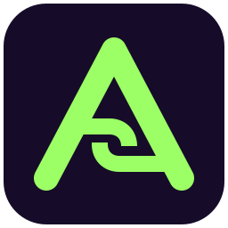
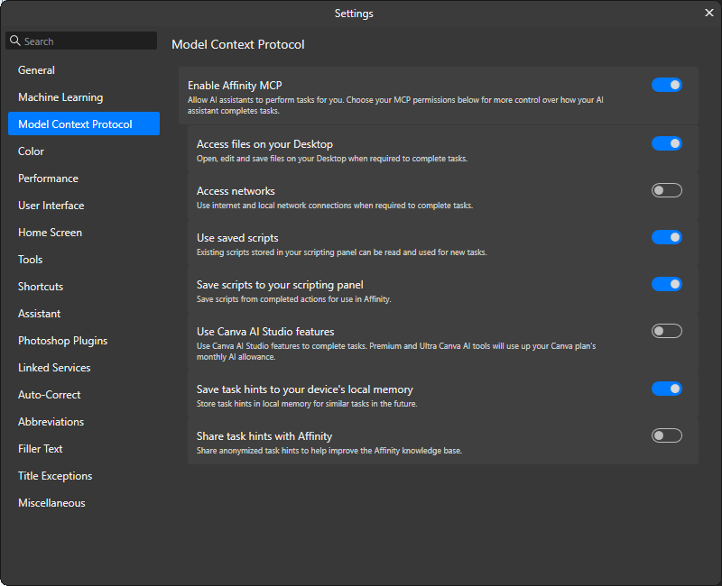

<p align="center">
  
</p>

# Affinity MCP

Select your Language: English | [简体中文](README.zh-cn.md)

A standalone plugin for **Codex, ZCode and Claude Code**, connecting to Affinity by Canva's local MCP server. One repository contains one plugin; its files live directly at the repository root.

Independent community project maintained by [Paloexiz](https://github.com/Paloexiz), not an official OpenAI, Z.ai, Anthropic, Canva or Affinity release.

## Affinity by Canva settings

Open **Settings → Model Context Protocol** in Affinity by Canva. **Enable Affinity MCP** is the only switch required to connect; the default endpoint is `http://localhost:6767/sse`.



The screenshot shows the recommended configuration. Keep **Access files on your Desktop**, both scripting-panel switches and **Save task hints to your device's local memory** on so those capabilities stay available. **Access networks**, **Use Canva AI Studio features** and **Share task hints with Affinity** are optional: switch them on only when you want what they do.

| Setting | Set it to | Effect |
| --- | --- | --- |
| Enable Affinity MCP | On (required) | Exposes the local MCP server that connects the agent to Affinity by Canva. |
| Access files on your Desktop | On | Lets scripts open, edit and save files on your Desktop when a task needs them. Paths outside the Desktop are denied, so this is not whole-disk access. |
| Access networks | Off unless a script needs HTTP | Lets scripts make HTTP requests through `network.js`. Independent of the MCP transport, so the connection works while it is off. |
| Use saved scripts | On | Lets the agent read scripts already stored in your Affinity scripting panel. |
| Save scripts to your scripting panel | On | Lets the agent save completed scripts into your Affinity scripting panel. |
| Use Canva AI Studio features | Off unless you want Canva AI | Lets scripts use Canva AI Studio features; the Premium and Ultra AI tools draw on your Canva plan's monthly AI allowance. Independent of the MCP connection. |
| Save task hints to your device's local memory | On | Stores task hints locally so similar future tasks start with that context. |
| Share task hints with Affinity | Optional — your choice | Shares anonymized task hints to help improve the Affinity knowledge base. |

Do not enable network or Canva AI Studio permissions just to connect or to edit ordinary document content.

## Requirements

- Affinity by Canva with **Enable Affinity MCP** on, running on the same computer as the agent.
- Node.js **24.20 or newer** on `PATH` as `node` (24.21 or newer recommended). The plugin's proxy connects to Affinity's local server using `node`; on Windows, older versions can abort when the process exits—observed after the client disconnects (libuv `UV_HANDLE_CLOSING` assertion, exit code `3221226505`).
- Codex, ZCode or Claude Code with plugin support.

## Install

### Codex

Add `Paloexiz/Affinity-MCP` in the plugin marketplace UI, then install **Affinity MCP**. CLI equivalent:

```shell
codex plugin marketplace add Paloexiz/Affinity-MCP
codex plugin add affinity-mcp@affinity-mcp
```

Codex reads `.agents/plugins/marketplace.json`. Its single plugin source is `./`. The plugin manifest defines its MCP launcher inline; Codex resolves `cwd: "."` to the installed plugin directory.

### ZCode

Open a workspace and go to **Settings → Plugins → Create → Add Plugin Marketplace**. Add `Paloexiz/Affinity-MCP` or this local repository directory, then install **affinity-mcp** from the personal marketplace.

ZCode loads the same `.claude-plugin/` manifests, `.mcp.json` and Skill as Claude Code. The shared marketplace includes its HTTPS SVG icon and Chinese description. Refresh the marketplace to pick up changes.

If the same client has the older `affinity-mcp@codex-plugins-by-deba33` enabled, disable that copy before enabling this one to avoid duplicate tools.

### Claude Code

Add this repository as a marketplace, then install the plugin:

```shell
claude plugin marketplace add https://github.com/Paloexiz/Affinity-MCP.git
claude plugin install affinity-mcp@affinity-mcp
```

Claude Code reads `.claude-plugin/plugin.json` and the single-entry `.claude-plugin/marketplace.json`. It automatically loads the shared Skill and root `.mcp.json`; no separate MCP registration is needed. For local development, use `claude --plugin-dir /path/to/Affinity-MCP` or add the local repository path as the marketplace.

### Update

Refresh the marketplace and update/reinstall the plugin in your client. For Codex CLI:

```shell
codex plugin marketplace upgrade affinity-mcp
codex plugin add affinity-mcp@affinity-mcp
```

Open a new task if the current task retains old tools or Skill content. For Claude Code, run `claude plugin marketplace update affinity-mcp` followed by `claude plugin update affinity-mcp@affinity-mcp`, then restart the session. Release versions must match both plugin manifests, the shared Claude Code/ZCode marketplace entry and the proxy's reported version.

## Use and limits

Start with: **Read the Affinity SDK preamble and list open documents without modifying them.** Read live SDK documentation before scripting; inspect actual results after edits.

The proxy forwards Affinity's SDK documentation, script execution, rendering, script-library and hint tools. These are gateways to the installed SDK, not separate implementations of every document operation.

See [supported operations and limits](skills/affinity-mcp/SKILL.md#supported-operations); only the listed cases are covered.

After a timeout or disconnect, inspect document state before retrying: the script may already have executed. Submitted tool calls are never replayed automatically. An offline fallback tool list does not prove a live Affinity by Canva connection.

## Supported features

- [x] **Connect to Affinity by Canva**: Codex, ZCode and Claude Code can call Affinity by Canva through its local MCP server.
- [x] **Read SDK resources**: list and read SDK documentation, search hints and save local hints when authorized.
- [x] **Run and inspect scripts**: execute JavaScript in Affinity by Canva and render the current canvas or selection to check the result.
- [x] **Work with documents and pages**: inspect open documents and save state, create multi-page documents, resize or switch canvases, and undo or redo changes.
- [x] **Edit text and typography**: create text frames, write or replace text, and set fonts, size, spacing, alignment and indentation.
- [x] **Work with vectors and artboards**: create, move and delete layers, containers, shapes and artboards, and handle geometry, bounds, names, locking and visibility.
- [x] **Edit selections and pixels**: select layers or text ranges, read and write bitmap pixels, and process pixels with rectangular raster selections.
- [x] **Apply fills and strokes**: use solid colours, gradients, hatches, strokes and existing vector brushes.
- [x] **Apply effects and image processing**: use the verified shadows, transparency, blend modes, filters, adjustments and image tracing.
- [x] **Edit margins and document properties**: read and modify the verified margins, units and canvas properties.
- [x] **Save and export**: save Affinity documents and package copies, export PNG files, and export existing macros.
- [x] **Edit slice export settings**: read, change and apply PNG size settings from an existing slice.
- [x] **Work with embedded content and picture frames**: read embedded documents and picture frames, and switch an embedded document's page or artboard.
- [x] **Use files, networking and dialogs**: when authorized, access desktop files, make local network requests, use timers and show SDK dialogs.
- [x] **Manage the local script library**: when authorized, list, read and save Affinity by Canva scripts.
- [x] **Recover from disconnects**: continue with new requests after reconnection without automatically repeating submitted calls.

## Unsupported or unverified features

The status below is current through **September 11, 2026**, based on Affinity by Canva **3.2.3.4646**. Later releases may behave differently.

- [ ] **Close documents through the SDK**: the close interface is not currently implemented.
- [ ] **Insert or stitch pages into an existing document**: the SDK has no usable entry point; it can only create a new multi-page document.
- [ ] **Create default brush objects directly**: the default RasterBrush and VectorBrush entry points are unavailable; an existing vector brush can still be read and modified.
- [ ] **Adjust RasterBrush properties**: no usable raster-brush object has been obtained, so opacity and spacing remain unverified.
- [ ] **Link text frames or insert individual glyph objects**: frame linking is unverified and the tested CharGlyph insertion path is unavailable; ordinary text insertion and replacement work.
- [ ] **Complete advanced vector operations**: curve editing, Boolean operations and every shape-parameter combination remain unverified.
- [ ] **Complete raster-selection operations**: add, subtract, intersect and polygon selections remain unverified.
- [ ] **Complete slice export workflows**: slices or ExportConfig objects cannot be created entirely through the SDK, and direct export with that configuration is unverified.
- [ ] **Set export width and height together**: the matching ExportScale entry point returned the wrong size type.
- [ ] **Use more export options**: PDF, bleed, multi-page export and other formats or presets remain unverified.
- [ ] **Create or replace picture-frame content**: only reading an existing picture frame has been verified.
- [ ] **Record or replay macros**: only exporting an existing macro has been verified.
- [ ] **Use every effect and image-processing option**: only selected filters, adjustments, fills, strokes and layer effects have been verified.
- [ ] **Use complete networking support**: public internet, TLS and asynchronous networking remain unverified; synchronous local requests work.
- [ ] **Copy files asynchronously**: the tested asynchronous copy path is unavailable; synchronous desktop file operations and some asynchronous reads work.
- [ ] **Use Canva AI features**: one generation command was denied before execution, and the remaining AI features are unverified.
- [ ] **Report SDK issues to Affinity by Canva**: no report has been sent, and every report requires explicit user authorization.

SDK operations not listed here remain unverified. Permission-controlled features must first be enabled in Affinity by Canva.

## Validation

```shell
node scripts/affinity-mcp-proxy.test.mjs
```

Tests cover newline/legacy framing, pagination, text/image forwarding, HTTP errors, disconnect without replay, reconnection, EOF shutdown, release metadata and the Codex/shared Claude Code-ZCode launchers under paths containing spaces and Unicode. Tests use a local mock service and do not modify Affinity by Canva documents.

## Sources and attribution

The layout follows [Superpowers](https://github.com/obra/superpowers) and its [single-entry index pointing to ./](https://github.com/obra/superpowers/blob/main/.claude-plugin/marketplace.json). ZCode reuses that format through its documented [Claude Code plugin compatibility](https://zcode.z.ai/en/docs/plugin). Claude Code integration follows its [plugin reference](https://code.claude.com/docs/en/plugins-reference) and [marketplace specification](https://code.claude.com/docs/en/plugin-marketplaces).

Proxy and Skill derive from [deba33/codex-plugins-by-deba33](https://github.com/deba33/codex-plugins-by-deba33), including the fixes in Paloexiz's fork at `9f2c2db`. Original MIT attribution is retained in [LICENSE.upstream](LICENSE.upstream) and [NOTICE](NOTICE). This repository uses [MIT](LICENSE).
