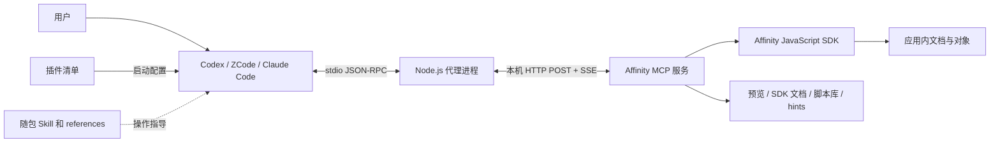
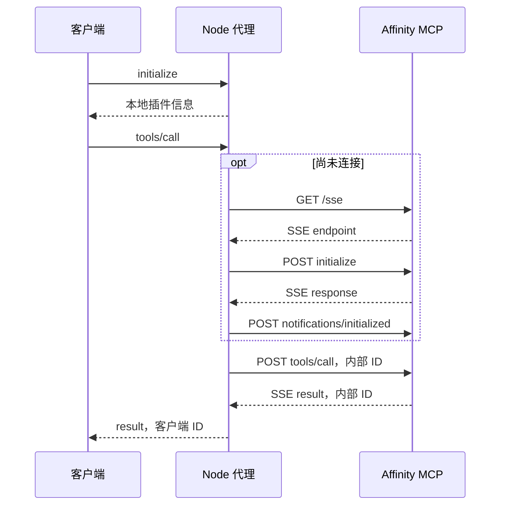

# Affinity MCP 架构说明

实现依据为仓库中的[代理源码](../scripts/affinity-mcp-proxy.mjs)和清单，插件标识 `0.1.11`；工作树改动不代表已发布新版本。SDK操作的构建差异单独记录在[SDK索引](sdk/README.md)。

## 目标和边界

本仓库提供一个插件，让 Codex、ZCode、Claude Code 经由本机 Node.js 代理访问 Affinity 的 MCP 服务。代理提供传输和消息转发，Affinity 应用执行脚本、操作文档并生成预览；随包 Skill 提供 Agent 的操作指导。仓库没有单独实现文本引擎、版面引擎或每一个 SDK 方法。[依据：仓库说明](../README.md)、[代理实现](../scripts/affinity-mcp-proxy.mjs)、[Skill](../skills/affinity-mcp/SKILL.md)。

图中代理是独立进程；Affinity MCP 服务与 SDK 属于外部应用能力。Skill 不在消息转发路径中，不会在代理内部强制验证脚本内容。[代理实现](../scripts/affinity-mcp-proxy.mjs)。

## 仓库构成

| 文件或目录 | 职责 | 不应归到它的职责 |
| --- | --- | --- |
| [`.agents/plugins/marketplace.json`](../.agents/plugins/marketplace.json) | Codex 单插件索引，来源 `./` | 不定义 SDK 能力 |
| [`.codex-plugin/plugin.json`](../.codex-plugin/plugin.json) | Codex 插件元数据、Skill 路径、内联 MCP 启动配置 | 不控制 Affinity 权限 |
| [`.claude-plugin/`](../.claude-plugin/plugin.json) 与 [市场索引](../.claude-plugin/marketplace.json) | Claude Code / ZCode 共用插件描述与版本 | 不保证客户端实际已刷新缓存 |
| [`.mcp.json`](../.mcp.json) | Claude Code / ZCode 共用 stdio 启动配置 | 不把 60 秒客户端配置传入代理的内部计时器 |
| [`scripts/affinity-mcp-proxy.mjs`](../scripts/affinity-mcp-proxy.mjs) | stdin 解析、请求路由、SSE 连接、响应关联、错误转发 | 不校验目标文档、不回滚 SDK 操作、不保存操作结果 |
| [`scripts/affinity-mcp-proxy.test.mjs`](../scripts/affinity-mcp-proxy.test.mjs) | 模拟服务上的进程边界和打包配置回归 | 不证明真实 SDK 操作有效 |
| [`skills/affinity-mcp/`](../skills/affinity-mcp/SKILL.md) | 操作入口、授权边界、样本与结果验收指导 | 不替代应用当前版本的运行证据 |
| `docs/` 中的公共技术文档与根目录 `AGENTS.md` | 架构、版本记录、脱敏技术摘要及维护约定 | 随仓库维护；不能引用被 Git 忽略的内容，本地专用说明与插件交付范围分别核对 |
| 本地内部归档 | 原始问题、个人工作材料和实验原始输出 | 保持忽略，不作为 docs 的内容依赖或证据引用 |

这是单上下文的小型仓库；文档按职责分开，代码仍是一个代理脚本。[领域约定](agents/domain.md)。

## 连接和一次请求

1. 客户端按清单启动 `node scripts/affinity-mcp-proxy.mjs`。Codex 使用插件目录作为 `cwd`；共用配置用 `${CLAUDE_PLUGIN_ROOT}` 定位脚本。[Codex 清单](../.codex-plugin/plugin.json)、[共用配置](../.mcp.json)。
2. 代理在本地回答客户端的 `initialize`、`ping`。只有 `tools/list` 或 `tools/call` 才触发对 Affinity 的惰性连接。因此 initialize/ping 成功不能证明应用在线。[代理实现](../scripts/affinity-mcp-proxy.mjs)。
3. 代理 GET `${AFFINITY_MCP_BASE_URL}/sse`，读取 `endpoint` 事件；只接受与配置基址相同 origin 的 POST 地址。随后向该地址发送 `initialize` 和 `notifications/initialized`。[代理实现](../scripts/affinity-mcp-proxy.mjs)。
4. 每次上游请求分配新的内部 ID，并放入内存 `pending` Map。请求经 HTTP POST 发出，结果从 SSE 返回；代理按内部 ID 完成 Promise，再用原客户端请求 ID 返回。[代理实现](../scripts/affinity-mcp-proxy.mjs)。
5. `tools/call` 的工具名、参数和结果被转发，结果可含文本、图像和 `isError`。代理不把脚本输出转换成业务成功结论；没有串行执行队列，客户端并发到来的请求可重叠等待。[代理实现](../scripts/affinity-mcp-proxy.mjs)。

客户端侧默认使用换行分隔 JSON；还兼容旧 `Content-Length` 帧，并以首字节选择连接的输入/输出模式。日志走 stderr。[代理实现](../scripts/affinity-mcp-proxy.mjs)。MCP `2025-11-25` 的标准 stdio 使用换行分隔；当前代理对 Affinity 使用的是独立 SSE 与 POST endpoint 的旧 HTTP+SSE 形态，不能因为配置中的协议日期较新就称为 Streamable HTTP 实现。[MCP transport 规范](https://modelcontextprotocol.io/specification/2025-11-25/basic/transports)。

## 协议表面和故障行为

| 请求或事件 | 当前行为 | 实现依据 |
| --- | --- | --- |
| `initialize` | 客户端侧支持`2025-11-25`；请求其他字符串时返回此支持版本，由客户端判断是否继续；缺失或非字符串protocolVersion返回`-32602`。只处理本地协商，不连接Affinity | [代理实现](../scripts/affinity-mcp-proxy.mjs)的CLIENT_PROTOCOL_VERSION与initialize分支；[MCP版本协商](https://modelcontextprotocol.io/specification/2025-11-25/basic/lifecycle#version-negotiation) |
| `tools/list` | 成功时原样转发结果与 `nextCursor`；无 cursor 的发现失败返回 11 个静态备用工具；有 cursor 时失败直接报错 | [代理实现](../scripts/affinity-mcp-proxy.mjs) |
| `tools/call` | 每次先确保连接；已提交调用不会自动重放 | [代理实现](../scripts/affinity-mcp-proxy.mjs) |
| `resources/list`、`prompts/list` | 返回空列表；SDK 文档通过工具读取 | [代理实现](../scripts/affinity-mcp-proxy.mjs) |
| 通知 | 客户端没有 id 的消息被忽略；上游 `notifications/initialized` 由代理自己发送 | [代理实现](../scripts/affinity-mcp-proxy.mjs) |
| 断开 SSE | 清理连接标记并拒绝所有 pending 请求；初始化通知结束前再次确认本次连接仍有效，失败不标记connected；后续独立新请求可重新连接 | [代理实现](../scripts/affinity-mcp-proxy.mjs) |
| stdin EOF、SIGINT、SIGTERM | 关闭连接、清理 pending，再退出 | [代理实现](../scripts/affinity-mcp-proxy.mjs) |
| 迟到响应 | 对应 ID 已不在 pending 时不再交付；不据此取消应用中的脚本 | [代理实现](../scripts/affinity-mcp-proxy.mjs) |
| 未知方法或坏输入 | 未知方法 `-32601`；坏 JSON `-32700`；无效 JSON-RPC `-32600` | [代理实现](../scripts/affinity-mcp-proxy.mjs) |
| 传输/上游异常 | 包装为 `-32603`，消息与error.data区分connect/endpoint/post/response/sse/upstream，保留cause/outcome，已知方法时包含method；本地输入/未知方法错误不保证有data。只有connect失败建议检查应用和MCP设置 | [代理实现](../scripts/affinity-mcp-proxy.mjs)的failure与handleMessage |

备用列表只能帮助工具发现；真正的能力目录以在线 `tools/list` 和 SDK topics 为准。`initialize`、`ping`、备用列表均不构成连接健康证明。[同上 tools/list 路由](../scripts/affinity-mcp-proxy.mjs)。

客户端侧的支持版本与`AFFINITY_MCP_PROTOCOL_VERSION`分开：后者只控制代理发给Affinity的初始化版本，客户端请求不会覆盖它。两段协商可以使用不同版本；声明版本不等于对所有可选MCP能力的全面认证。

## 时间边界与恢复

| 等待阶段 | 配置或实现值 | 范围 |
| --- | --- | --- |
| 首次 GET `/sse` 返回 | 30,000 ms | Fetch 响应返回后清除此计时器；不是整个 SSE 流寿命 |
| 等待 endpoint | 50 次 × 100 ms | 约 5 秒的轮询窗口 |
| 上游响应 pending | AFFINITY_MCP_REQUEST_TIMEOUT_MS，默认30,000 ms | 从注册pending开始；POST未结束时归因post阶段，否则response阶段 |
| 单个 POST | 同一环境配置 | 与连接AbortSignal合并，也用于initialize请求及initialized通知 |
| 共用客户端 `.mcp.json` | `timeoutMs: 60000` | 客户端配置，不替换代理环境值；Codex内联配置未设此字段 |

依据：[代理实现](../scripts/affinity-mcp-proxy.mjs)的REQUEST_TIMEOUT_MS、request与post、[共用配置](../.mcp.json)。允许100～300000毫秒整数，未设置使用默认值；空值、非整数和越界值在启动时报错退出，stderr不打印配置值。更改环境需重启代理。初始SSE建连和endpoint等待仍独立，各阶段串接/重叠，不是整次调用deadline；客户端预算须相应覆盖。

请求结果以先到的终止事件为准：SSE成功/上游错误可以在POST仍等候时完成请求，随后POST错误仍被观察但不改变已交付结果。等待超时移除pending，迟到成功/错误仍丢弃，不补第二次响应。SSE解析失败/断线拒绝当前pending，后续新请求可重连。工具尝试提交后的传输失败或上游错误保守标outcome=unknown，先读回文档实际状态；not_submitted仅表示本次业务工具未提交（例如建连/初始化失败），不推断历史操作状态。代理不取消或回滚应用内脚本。

连接失败、HTTP 错误、脚本错误、权限拒绝、工具超时分别定位。超时或断线后应用可能已经改变文档，代理没有回滚机制；先重读 preamble 和文档身份、检查实际状态，再决定后续动作。[Skill 恢复要求](../skills/affinity-mcp/SKILL.md)、[版本样本的错误边界](sdk/3.3.0.4850.md#errors)。

## 运行和状态归属

| 状态 | 所有者及寿命 |
| --- | --- |
| 连接、endpoint、内部请求 ID、pending | 代理进程内存；关闭连接会清理 pending/endpoint，不把请求落盘 |
| 当前文档、spread、节点、撤销历史、保存状态 | Affinity 应用；网络断开不证明操作已取消 |
| 当前工具目录、安装 Skill 副本、输出截断和图像附件处理 | 客户端/宿主；须与仓库内容分别核对 |
| 文件访问、脚本网络、脚本库、hint/AI 权限 | Affinity 设置及用户授权；不是代理传输本身提供的权限 |

依据：[代理内存字段及关闭逻辑](../scripts/affinity-mcp-proxy.mjs)、[运行边界 reference](../skills/affinity-mcp/references/scripting-pitfalls.md)、[权限说明](../skills/affinity-mcp/SKILL.md)。代理拒绝重定向并检查 endpoint 同源，但源码没有认证配置或脚本授权判定；默认部署是同机 localhost。将 BASE_URL 改成远程地址需要另行评估，不能从当前文档推导远程部署保证。[代理实现](../scripts/affinity-mcp-proxy.mjs)。

## 验证覆盖与维护入口

仓库开发参与平台包括 Windows、macOS、Linux；维护工具不得依赖个人机器路径或只提供单一平台命令。仓库 [文档 hooks](hooks.md) 使用跨平台 Node.js 实现及独立的 PowerShell/POSIX 启动入口，其三平台测试与 Affinity SDK 的应用平台证据分别记录。

现有测试命令为 `node scripts/affinity-mcp-proxy.test.mjs`。本地模拟服务与真实子进程覆盖两种帧格式、分页、文本/图像透传、HTTP503、配置默认/上下界/非法值、连接/endpoint/初始化与通知等待、延迟POST/SSE竞态、迟到成功与错误不重复响应、异常SSE、断开不重放及后续重连、EOF、版本一致性和含空格/中文的安装路径。[测试实现](../scripts/affinity-mcp-proxy.test.mjs)。

测试不证明真实Affinity SDK功能，也未穷尽备用列表、30秒SSE建连的所有网络故障、权限配置和全部协议坏输入。SDK证据由[构建记录](sdk/README.md)承担，新场景见[验证指南](sdk/verification.md)，不把模拟服务通过写成“已适配全部功能”。

后续改变连接策略、工具转发语义或部署边界时，更新本页和对应测试；若实际作出新的长期架构选择，再新增 ADR 记录当时的原因、选项和后果。本页未追认历史作者未记录的设计动机。
